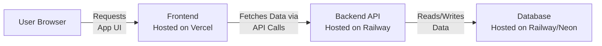

### The Best Strategy: Host Backend and Frontend Separately

Modern apps are often split ("decoupled"). This means your React frontend and Node.js backend are hosted on different services. This is easier, more scalable, and often cheaper (or free) for projects like yours.

*   **Frontend:** Hosted on a platform built for static files (like **Vercel** or **Netlify**).
*   **Backend:** Hosted on a platform that can run Node.js servers (like **Railway** or **Render**).
*   **Database:** Usually provided as a service by your backend host or a separate provider (like **Supabase** or **Railway's/Neon's PostgreSQL**).

This diagram shows how the hosted pieces talk to each other:

---

### Recommended Hosting Stack (The Easiest & Free Plan)

This is the stack I recommend you use. It's modern, developer-friendly, and the free tiers are more than enough for your university project.

#### 1. Database: Railway (PostgreSQL) or Neon.tech
*   **Why:** They offer free, hassle-free PostgreSQL databases. You don't have to install or manage anything. Just create an account and get a database connection string.
*   **My Pick:** **Railway**. It's incredibly simple and integrates perfectly with the next step.

#### 2. Backend (Node.js + Express API): Railway
*   **Why:** Railway is perfect for hosting backends. You connect your GitHub repo, and it automatically deploys your Node.js app every time you push code. It gives you a live URL (e.g., `https://yourbackend-api.railway.app`).
*   **How:** You will put your backend code in a GitHub repo. Railway will connect to that repo and deploy it.

#### 3. Frontend (React App): Vercel
*   **Why:** Vercel is built by the creators of React. It's the absolute easiest way to host a React app. It also connects to your GitHub repo and deploys instantly. It gives you a live URL (e.g., `https://yourfrontend.vercel.app`).
*   **Crucial Step:** You will need to configure your React app to send API requests to your Railway backend URL (not `localhost`).

---

### Step-by-Step Hosting Plan

1.  **Develop Locally First:** Build most of your app on your own machine. Use a local PostgreSQL database (installed on your PC) during development.
2.  **Create GitHub Repositories:**
    *   Create one GitHub repository for your `backend` code.
    *   Create another GitHub repository for your `frontend` code.
3.  **Host the Database:**
    *   Sign up for [Railway](https://railway.app/).
    *   Use their dashboard to create a new PostgreSQL database.
    *   Copy the `DATABASE_URL` connection string they provide.
4.  **Host the Backend:**
    *   In your `backend` code, use the `DATABASE_URL` from Railway instead of your local one (use environment variables!).
    *   Push your code to the `backend` GitHub repo.
    *   On Railway, create a new "Project" and connect it to your `backend` GitHub repo. It will deploy automatically.
    *   Railway will give you a URL for your live API (e.g., `https://mims-backend-production.up.railway.app`).
5.  **Host the Frontend:**
    *   Sign up for [Vercel](https://vercel.com/).
    *   In your `frontend` code, change all API calls from `http://localhost:3001` to your live backend URL from Railway.
    *   Push the updated code to your `frontend` GitHub repo.
    *   On Vercel, import your `frontend` GitHub repo. It will deploy automatically.
    *   Vercel will give you a URL for your live website (e.g., `https://mims-frontend.vercel.app`).

**You are now live!** Anyone with the Vercel link can use your app.

---

### How to Justify Your Choice (If Asked)

> "We chose to host the frontend and backend separately on specialized platforms—Vercel for the React frontend and Railway for the Node.js backend and database. This is a modern, best-practice approach called the JAMstack. It allows us to:
>
> 1.  **Scale Cost-Effectively:** Each part can scale independently based on demand.
> 2.  **Maximize Performance:** Vercel is globally optimized for serving static assets quickly, while Railway is optimized for running servers.
> 3.  **Simplify Deployment:** Both platforms integrate directly with GitHub, enabling automatic deployments every time we push code, which is a core practice of CI/CD (Continuous Integration/Continuous Deployment).
> 4.  **Stay Within Budget:** The generous free tiers of these services are more than sufficient for our project's scope and demonstration needs."
